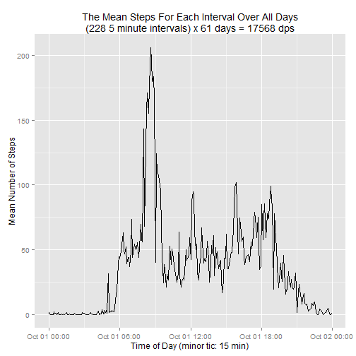
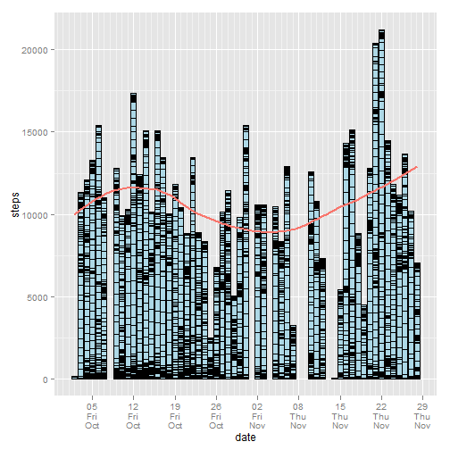
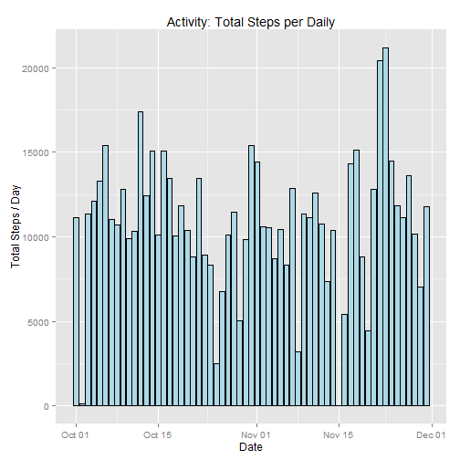
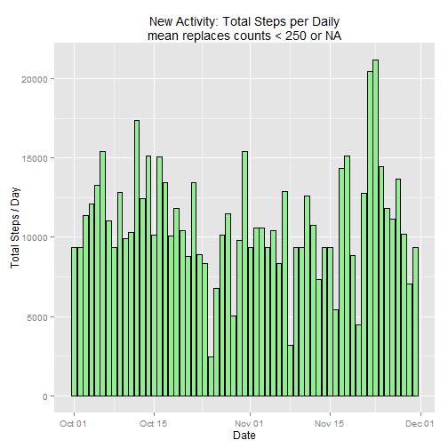

This is an R Markdown document. Markdown is a simple formatting syntax for authoring HTML, PDF, and MS Word documents. For more details on using R Markdown see <http://rmarkdown.rstudio.com>.

When you click the **Knit** button a document will be generated that includes both content as well as the output of any embedded R code chunks within the document. You can embed an R code chunk like this:

Introduction
------------

It is now possible to collect a large amount of data about personal movement using activity monitoring devices such as a Fitbit, Nike Fuelband, or Jawbone Up. These type of devices are part of the "quantified self" movement - a group of enthusiasts who take measurements about themselves regularly to improve their health, to find patterns in their behavior, or because they are tech geeks. But these data remain under-utilized both because the raw data are hard to obtain and there is a lack of statistical methods and software for processing and interpreting the data.

This assignment makes use of data from a personal activity monitoring device. This device collects data at 5 minute intervals through out the day. The data consists of two months of data from an anonymous individual collected during the months of October and November, 2012 and include the number of steps taken in 5 minute intervals each day.
Data

The data for this assignment can be downloaded from the course web site:

    Dataset: Activity monitoring data [52K]

The variables included in this dataset are:

    steps: Number of steps taking in a 5-minute interval (missing values are coded as NA)

    date: The date on which the measurement was taken in YYYY-MM-DD format

    interval: Identifier for the 5-minute interval in which measurement was taken

The dataset is stored in a comma-separated-value (CSV) file and there are a total of 17,568 observations in this dataset.
Assignment

This assignment will be described in multiple parts. You will need to write a report that answers the questions detailed below. Ultimately, you will need to complete the entire assignment in a single R markdown document that can be processed by knitr and be transformed into an HTML file.

Throughout your report make sure you always include the code that you used to generate the output you present. When writing code chunks in the R markdown document, always use echo = TRUE so that someone else will be able to read the code. This assignment will be evaluated via peer assessment so it is essential that your peer evaluators be able to review the code for your analysis.

For the plotting aspects of this assignment, feel free to use any plotting system in R (i.e., base, lattice, ggplot2)

Fork/clone the GitHub repository created for this assignment. You will submit this assignment by pushing your completed files into your forked repository on GitHub. The assignment submission will consist of the URL to your GitHub repository and the SHA-1 commit ID for your repository state.

NOTE: The GitHub repository also contains the dataset for the assignment so you do not have to download the data separately.

-------------------------------------------------------------------------------------------------------------------

```r
library("plyr")
library("ggplot2")
library("lubridate")
library("chron")
library("scales")
library("mice")

# Multiple plot function
#
# ggplot objects can be passed in ..., or to plotlist (as a list of ggplot objects)
# - cols:   Number of columns in layout
# - layout: A matrix specifying the layout. If present, 'cols' is ignored.
#
# If the layout is something like matrix(c(1,2,3,3), nrow=2, byrow=TRUE),
# then plot 1 will go in the upper left, 2 will go in the upper right, and
# 3 will go all the way across the bottom.
#
multiplot <- function(..., plotlist=NULL, file, cols=1, layout=NULL) {
  require(grid)

  # Make a list from the ... arguments and plotlist
  plots <- c(list(...), plotlist)

  numPlots = length(plots)

  # If layout is NULL, then use 'cols' to determine layout
  if (is.null(layout)) {
    # Make the panel
    # ncol: Number of columns of plots
    # nrow: Number of rows needed, calculated from # of cols
    layout <- matrix(seq(1, cols * ceiling(numPlots/cols)),
                    ncol = cols, nrow = ceiling(numPlots/cols))
  }

 if (numPlots==1) {
    print(plots[[1]])

  } else {
    # Set up the page
    grid.newpage()
    pushViewport(viewport(layout = grid.layout(nrow(layout), ncol(layout))))

    # Make each plot, in the correct location
    for (i in 1:numPlots) {
      # Get the i,j matrix positions of the regions that contain this subplot
      matchidx <- as.data.frame(which(layout == i, arr.ind = TRUE))

      print(plots[[i]], vp = viewport(layout.pos.row = matchidx$row,
                                      layout.pos.col = matchidx$col))
    }
  }
}
```
run knit2html first w/PA1_driver.R ... then set up and load any function libraries and runs the script
------------------------------------------------------------------------------------------------------


```r
mStepsPerDay <- matrix(nrow=3, ncol=2, dimnames=list(c("orgSteps","newSteps1","newSteps2"),c("mean","median")))

activityDir <- "K:/COURSES/JHU_DataScience/Statistical_Inference"
pathToDataSet <- paste(activityDir, 'activity.csv', sep='/')
```
Loading the data
----------------


```r
activity <- read.csv(pathToDataSet)    
```
Find the total steps per day. Note: there may be missing values
-----------------------------------------------------------------------------------------


```r
stepsPerDay <- ddply(activity, .(date), summarize, totalSteps=sum(steps, na.rm=TRUE))
head(stepsPerDay,10)
```

```
##          date totalSteps
## 1  2012-10-01          0
## 2  2012-10-02        126
## 3  2012-10-03      11352
## 4  2012-10-04      12116
## 5  2012-10-05      13294
## 6  2012-10-06      15420
## 7  2012-10-07      11015
## 8  2012-10-08          0
## 9  2012-10-09      12811
## 10 2012-10-10       9900
```
Convert the day dates to character type for 2-wk splits, otherwise the x-axis looks like mush
---------------------------------------------------------------------------------------------


```r
stepsPerDay$date <- as.Date(stepsPerDay$date, "%Y-%m-%d")
head(stepsPerDay$date)
```

```
## [1] "2012-10-01" "2012-10-02" "2012-10-03" "2012-10-04" "2012-10-05"
## [6] "2012-10-06"
```
Make a histogram of the total steps each day
--------------------------------------------

 
What is the mean and median total number of steps taken per day?
----------------------------------------------------------------


```r
mStepsPerDay[1,1] <- mean(stepsPerDay$totalSteps)
mStepsPerDay[1,2] <- median(stepsPerDay$totalSteps)
mStepsPerDay
```

```
##           mean median
## orgSteps  9354  10395
## newSteps1   NA     NA
## newSteps2   NA     NA
```
what is the daily average activity pattern?
-------------------------------------------


```r
stepsPerInterval <- matrix(nrow=288, ncol=2, dimnames=list(NULL,c("interval","avgSteps")))
stepsPerInterval <- ddply(activity, .(interval), summarize, avgSteps=mean(steps, na.rm=TRUE))

#val <- 0
#offset <- 1
#notNAval <- 0
#for (i in 1:61) 
#    {
#    if (!is.na(activity$steps[offset]))
#        {
#        print(offset)
#        notNAval <- notNAval+1; print(notNAval)
#        val <- val+activity$steps[offset]
#        }
#    offset <- offset+288
#    }
#    val/notNAval
```
make a time series plot of 5-minute interval vs average steps for all days
--------------------------------------------------------------------------

 
Find the interval with the maximum steps
----------------------------------------

```r
maxstepsPerInterval <- stepsPerInterval$interval[which.max(stepsPerInterval$avgSteps)]
print(sprintf("interval with the maximum counts: %d", maxstepsPerInterval))
```

```
## [1] "interval with the maximum counts: 835"
```
Fill in the missing data from the original dataset using MICE, 
which is just a faster way of filling in blanks with NAs
--------------------------------------------------------------

```
## [1] "Total missing values: 2304"
```

```
## 
##  iter imp variable
##   1   1  steps
##   1   2  steps
##   1   3  steps
##   1   4  steps
##   1   5  steps
##   2   1  steps
##   2   2  steps
##   2   3  steps
##   2   4  steps
##   2   5  steps
##   3   1  steps
##   3   2  steps
##   3   3  steps
##   3   4  steps
##   3   5  steps
##   4   1  steps
##   4   2  steps
##   4   3  steps
##   4   4  steps
##   4   5  steps
##   5   1  steps
##   5   2  steps
##   5   3  steps
##   5   4  steps
##   5   5  steps
```

```
##         date totalSteps
## 1 2012-10-01       9354
## 2 2012-10-02       9354
## 3 2012-10-03      11352
## 4 2012-10-04      12116
## 5 2012-10-05      13294
## 6 2012-10-06      15420
```
Determine the mean and median for the new 'filled' data set
-----------------------------------------------------------

```r
newStepsPerDay <- ddply(newFilledActivity, .(date), summarize, totalSteps=sum(steps))
newStepsPerDay$date <- as.Date(newStepsPerDay$date, "%Y-%m-%d")

newStepActivity <- ddply(newStepActivity, .(date), summarize, totalSteps=sum(steps))
```

```
## Error: object 'steps' not found
```

```r
newStepActivity$date <- as.Date(newStepActivity$date, "%Y-%m-%d")
head(newStepActivity)
```

```
##         date totalSteps
## 1 2012-10-01       9354
## 2 2012-10-02       9354
## 3 2012-10-03      11352
## 4 2012-10-04      12116
## 5 2012-10-05      13294
## 6 2012-10-06      15420
```

```r
mStepsPerDay[2,1] <- mean(newStepsPerDay$totalSteps)
mStepsPerDay[2,2] <- median(newStepsPerDay$totalSteps)
mStepsPerDay
```

```
##            mean median
## orgSteps   9354  10395
## newSteps1 10824  11015
## newSteps2    NA     NA
```

```r
mStepsPerDay[3,1] <- mean(newStepActivity$totalSteps)
mStepsPerDay[3,2] <- median(newStepActivity$totalSteps)
mStepsPerDay
```

```
##            mean median
## orgSteps   9354  10395
## newSteps1 10824  11015
## newSteps2 10885  10395
```
Make a new histogram
--------------------

```r
        activity$date <- format(activity$date)
        activity$date <- as.POSIXct(strptime(paste(activity$date, "00:00:00", sep=" "),"%Y-%m-%d %H:%M:%S")) 

        maxStepsPerInterval <- ddply(activity, .(date), summarize, mSteps=sum(steps, na.rm=FALSE))

        
        ggplot(data=activity, aes(x=date, y=steps)) + 
        geom_bar(fill="lightblue", color="black", stat="identity") +
        geom_line(data=maxStepsPerInterval, 
                  aes(x=date, y=mSteps, color="red", lwd="2"), 
                  stat="smooth", method="loess") +
        scale_x_datetime(breaks = '7 days', 
                         minor_breaks="1 day", 
                         labels=date_format('%d\n%a\n%b')) +
        theme(legend.position = "none") 
```

```
## Warning: Removed 8 rows containing missing values (stat_smooth).
## Warning: Removed 2304 rows containing missing values (position_stack).
```

 

```r
        ggplot(newStepsPerDay, aes(x=date, y=totalSteps)) +
        geom_bar(fill="lightblue", color="black", stat="identity") +
        labs(x="Date", y="Total Steps / Day", title="Activity: Total Steps per Daily")
```

 

```r
        ggplot(newStepActivity, aes(x=date, y=totalSteps)) +
        geom_bar(fill="lightgreen", color="black", stat="identity") +
        labs(x="Date", y="Total Steps / Day", title="New Activity: Total Steps per Daily\nmean replaces counts < 250 or NA")
```

 


```r
# This example uses the ChickWeight dataset, which comes with ggplot2
# First plot
p1 <- 
    ggplot(ChickWeight, aes(x=Time, y=weight, colour=Diet, group=Chick)) +
    geom_line() +
    ggtitle("Growth curve for individual chicks")

# Second plot
p2 <- 
    ggplot(ChickWeight, aes(x=Time, y=weight, colour=Diet)) +
    geom_point(alpha=.3) +
    geom_smooth(alpha=.2, size=1) +
    ggtitle("Fitted growth curve per diet")

# Third plot
p3 <- 
    ggplot(subset(ChickWeight, Time==21), aes(x=weight, colour=Diet)) +
    geom_density() +
    ggtitle("Final weight, by diet")

# Fourth plot
p4 <- 
    ggplot(subset(ChickWeight, Time==21), aes(x=weight, fill=Diet)) +
    geom_histogram(colour="black", binwidth=50) +
    facet_grid(Diet ~ .) +
    ggtitle("Final weight, by diet") +
    theme(legend.position="none")        # No legend (redundant in this graph)    

#multiplot(p5, p6, p8, p7, cols=2)

#Note that the `echo = FALSE` parameter was added to the code chunk to prevent printing of the R code that generated the plot.
```
